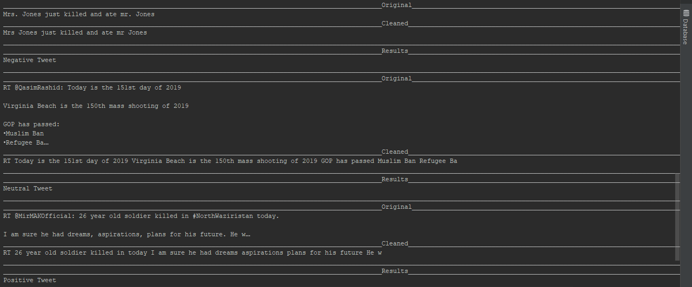

# Twitter-opinion-mining
An application which fetches real-time live tweets depending upon user's search query, performs NLP tasks and determines whether a piece of writing (tweet) is positive, negative or neutral.
<h6> output</h6>

